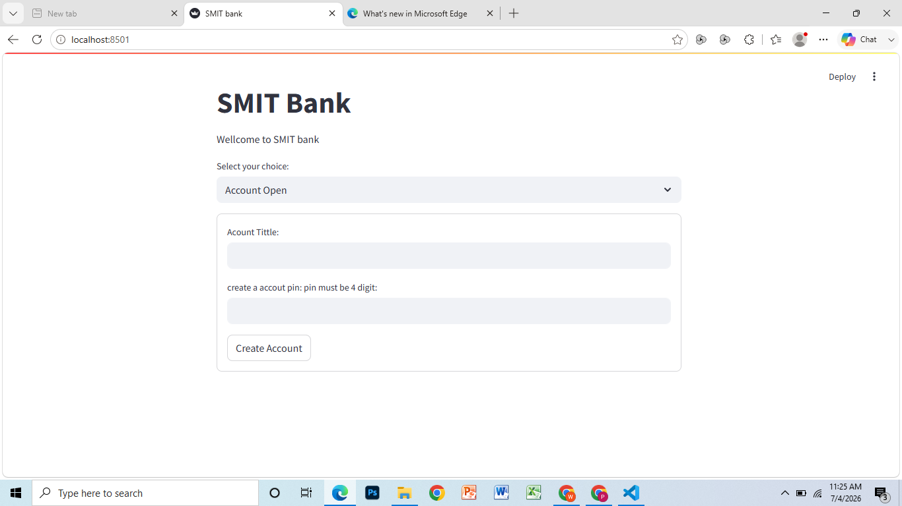
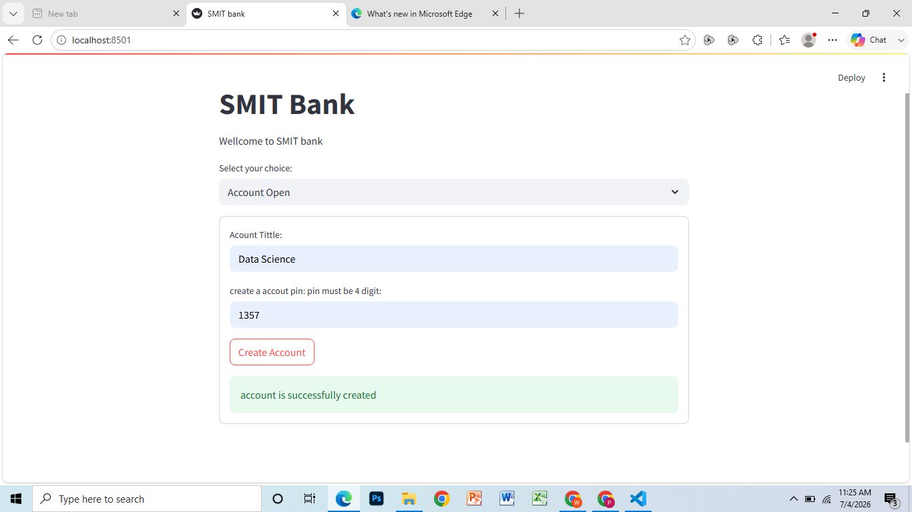
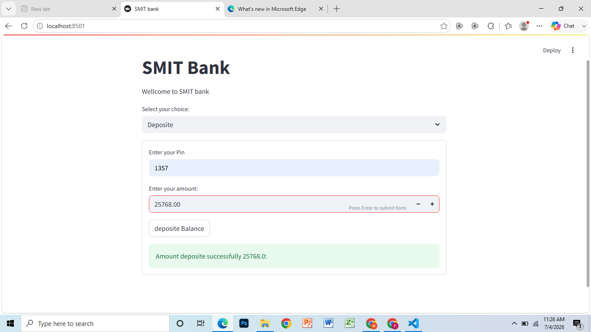
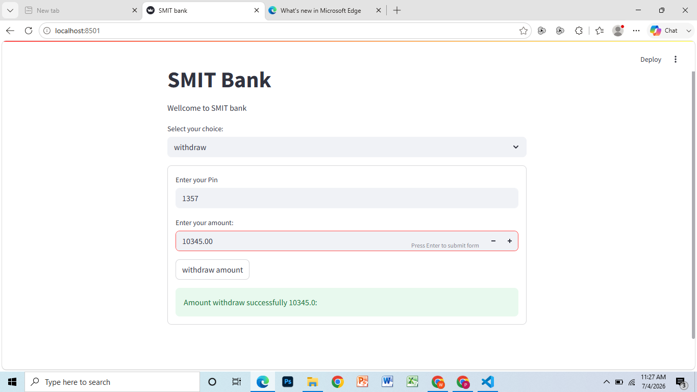
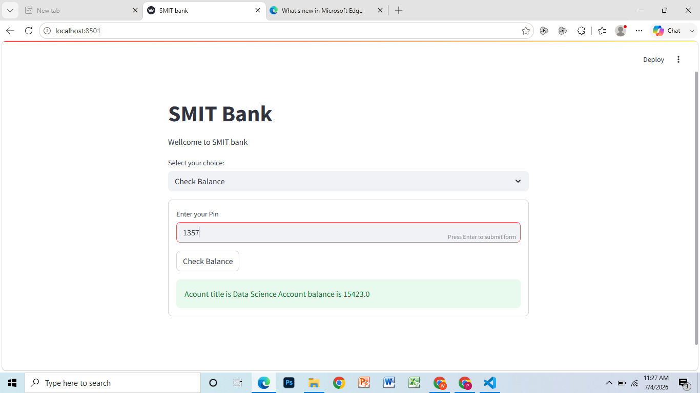

# 🏦 SMIT Bank Management System

A simple and interactive **Bank Management System** built with **Python** and **Streamlit**. This project allows users to create a bank account, deposit money, withdraw money, and check their account balance through a user-friendly web interface.

---

## 📖 Project Overview

The **SMIT Bank Management System** is a beginner-friendly banking application developed using **Python** and **Streamlit**. It demonstrates the use of Python functions, conditional statements, dictionaries, and Streamlit's session state to manage account information during runtime.

This project provides a clean and interactive interface where users can perform basic banking operations without using a database.

---

## ✨ Features

* 🆕 Create a new bank account
* 🔐 PIN-based account verification
* 💰 Deposit money
* 💸 Withdraw money
* 📊 Check account balance
* 🖥️ Simple and interactive Streamlit interface

---

## 🛠️ Technologies Used

* Python
* Streamlit

---

## 📂 Project Structure

```text
SMIT-Bank-Management-System
│
├── Bank_Management_System.py
├── Screenshots
│   ├── Home_Page.png
│   ├── Account_Open.png
│   ├── Deposit.png
│   ├── Withdraw.png
│   └── Check_Balance.png
├── .gitignore
├── LICENSE
├── README.md
└── requirements.txt
```

---

## 🚀 Installation

### 1️⃣ Clone the Repository

```bash
git clone https://github.com/rasib-ai-dev/SMIT-Bank-Management-System.git
```

### 2️⃣ Navigate to the Project Directory

```bash
cd SMIT-Bank-Management-System
```

### 3️⃣ Install the Required Dependencies

```bash
pip install -r requirements.txt
```

### 4️⃣ Run the Application

```bash
streamlit run Bank_Management_System.py
```

---

## 📷 Application Screenshots

### 🏠 Home Page



---

### 👤 Account Creation



---

### 💰 Deposit Money



---

### 💸 Withdraw Money



---

### 📊 Check Balance



---

## 🤝 Contributing

Contributions, suggestions, and improvements are welcome.

If you would like to improve this project, feel free to fork the repository and submit a pull request.

---

## 📄 License

This project is licensed under the **MIT License**. See the **LICENSE** file for more details.

---

## 👨‍💻 Author

**Muhammad Rasib**

GitHub: **https://github.com/rasib-ai-dev**

---

## ⭐ Support

If you found this project helpful, please consider giving it a **Star ⭐** on GitHub.
